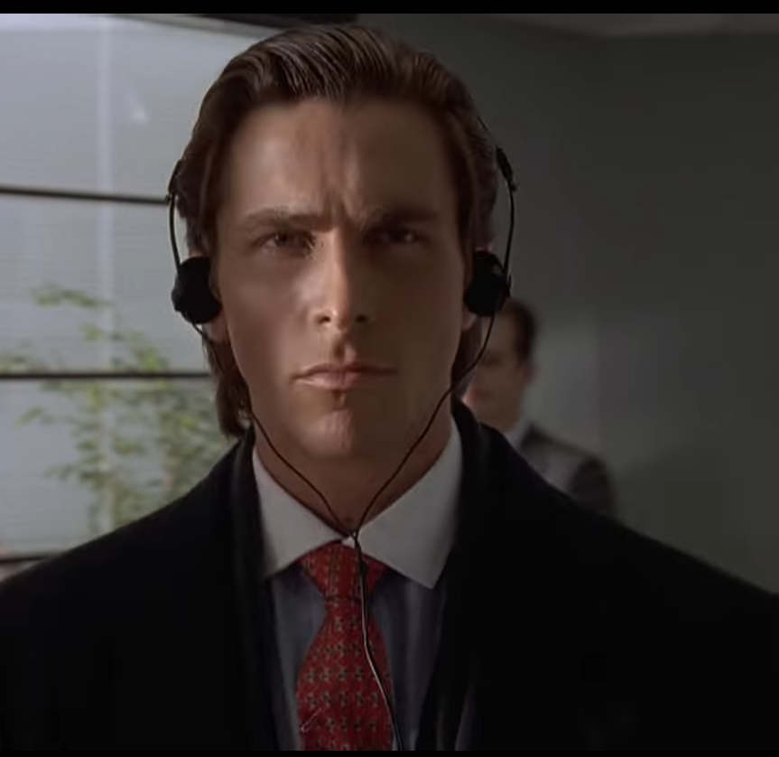

# Кто я?

> Я живу в доме American Gardens на Западной 81-й улице, на одиннадцатом этаже.
> 
> Меня зовут Патрик Бейтман. Мне 27 лет.
> 
> Я верю в заботу о себе, в сбалансированное питание и в строгую программу упражнений.

---

## Утро

> Утром, если лицо немного опухшее, я надеваю ледяной компресс, пока делаю упражнения на пресс. Теперь я могу сделать тысячу.
---

## Ритуал ухода

- После того как снимаю компресс, я использую лосьон для глубокого очищения пор.
- В душе я использую гелевый очищающий крем, активируемый водой
- потом медово-миндальный скраб для тела
- а для лица — отшелушивающий гелевый скраб
- Затем я наношу травяную мятную маску для лица, которую оставляю на десять минут, пока готовлю остальную часть рутины.
- Я всегда использую лосьон после бритья с минимальным содержанием спирта или вообще без него, потому что спирт сушит кожу и делает тебя старше.
- Потом увлажняющий крем, затем антивозрастной бальзам для кожи вокруг глаз
- и в завершение — финальный увлажняющий защитный лосьон…

---

  

## Финал

> Существует идея Патрика Бейтмена.  
> Некая абстракция.  
> Но настоящего меня нет.  
> Есть лишь сущность.  
> Нечто иллюзорное.
>
> Хотя я могу скрывать свой холодный взгляд, и ты можешь пожать мне руку и почувствовать плоть, сжимающую твою, и, возможно, ты даже ощутишь, что наши стили жизни, вероятно, схожи… я просто не существую там.